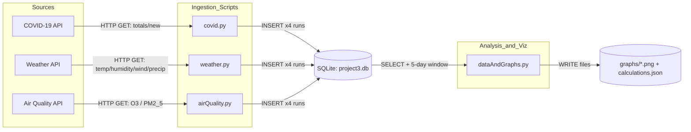

# Quality Control — COVID-19, Weather & Air Quality (Ann Arbor)

This project explores the relationship between **COVID-19 cases** and **environmental factors** (weather and air quality) in the Ann Arbor area. We collect data from public APIs, store it in SQLite, compute **5-day averages**, and generate graphs and a JSON summary for analysis. The study window begins **March 22, 2020** and spans **100 days**.  
*Team: Londyn Jefferson, Grace Strom, Ansileen Washington.*

## Table of Contents
- [Quickstart](#quickstart)
  - [macOS / Linux](#macos--linux)
  - [Windows](#windows)
- [Features](#features)
- [Architecture](#architecture)
- [Usage Examples](#usage-examples)
- [FAQ](#faq)
- [Dependencies](#dependencies)
- [Acknowledgements](#acknowledgements)
- [License](#license)

---

## Quickstart

**Prerequisites**
- Python **3.9+**
- Internet access for public APIs

### macOS / Linux

**1) Clone the repo**
```bash
git clone https://github.com/londynj/tchassignmnent.git
cd tchassignmnent
````

**2) Create & activate a virtual environment**

```bash
python3 -m venv .venv
source .venv/bin/activate
python -m pip install -U pip
```

**3) Install dependencies**

```bash
pip install -r requirements.txt
```

**4) Set the SQLite database name (optional)**
In `airQuality.py`, `covid.py`, and `weather.py` (inside `main()`), set:

```python
set_up_database('project3.db')  # change name if you want a different DB
```

In `dataAndGraphs.py` (inside `main()`), set:

```python
conn = sqlite3.connect(path + "/" + 'project3.db')
```

**5) Ingest data into SQLite (each script is run four times)**

```bash
python airQuality.py
python airQuality.py
python airQuality.py
python airQuality.py

python covid.py
python covid.py
python covid.py
python covid.py

python weather.py
python weather.py
python weather.py
python weather.py
```

**6) Generate charts and the calculations file**

```bash
python dataAndGraphs.py
```

---

### Windows

**1) Clone the repo**

```powershell
git clone https://github.com/londynj/tchassignmnent.git
cd tchassignmnent
```

**2) Create & activate a virtual environment**

```powershell
py -m venv .venv
.\.venv\Scripts\activate
python -m pip install -U pip
```

**3) Install dependencies**

```powershell
pip install -r requirements.txt
```

**4) Set the SQLite database name (optional)**
In `airQuality.py`, `covid.py`, and `weather.py` (inside `main()`), set:

```python
set_up_database('project3.db')  # change name if you want a different DB
```

In `dataAndGraphs.py` (inside `main()`), set:

```python
conn = sqlite3.connect(path + "/" + 'project3.db')
```

**5) Ingest data into SQLite (each script is run four times)**

```powershell
py airQuality.py
py airQuality.py
py airQuality.py
py airQuality.py

py covid.py
py covid.py
py covid.py
py covid.py

py weather.py
py weather.py
py weather.py
py weather.py
```

**6) Generate charts and the calculations file**

```powershell
py dataAndGraphs.py
```

---

## Features

* Multi-source ingest of COVID-19, weather, and air-quality metrics for Ann Arbor
* SQLite data store with tables for COVID cases, weather measurements, and air quality (O₃, PM2.5)
* **5-day** interval aggregation for totals/new cases and environmental metrics
* Visualizations (line charts, pie chart) plus a JSON summary of calculated values
* Simple, reproducible scripts: `covid.py`, `weather.py`, `airQuality.py`, `dataAndGraphs.py`

---

## Architecture

**Diagram summary (text alternative):**
COVID-19, Weather, and Air Quality APIs feed ingest scripts into a single SQLite database. The analysis script reads from SQLite, performs **5-day** windowing, and outputs a JSON summary and PNG charts.



---

## Usage Examples

**Run the full pipeline (shell)**

```bash
# after configuring DB names if desired
python airQuality.py && python airQuality.py && python airQuality.py && python airQuality.py
python covid.py      && python covid.py      && python covid.py      && python covid.py
python weather.py    && python weather.py    && python weather.py    && python weather.py
python dataAndGraphs.py   # writes charts into graphs/ and calculations.json
```

**Example — helper calls used in analysis (`dataAndGraphs.py`)**

```python
# Count air-quality rows in a value range:
from dataAndGraphs import fetch
count = fetch(cur, col='pm2_5', min=12.1, max=35.4)
print(count)
```

```python
# Export calculated values to JSON:
from dataAndGraphs import write_calc_to_file
write_calc_to_file(cur)   # writes calculations.json
```

**(Add visuals)**


---

## FAQ

**Why do I run each ingest script four times?**
The tables are filled incrementally by date buckets; repeated runs ensure the full 100-day window is populated before aggregation.

**What exactly is aggregated?**
COVID totals/new cases are averaged over 5-day windows; weather and air-quality metrics are grouped the same way for comparison.

**Where do the outputs go?**
Graphs are written to `graphs/`. The calculated results are saved as a JSON file (`calculations.json`).

**Can I change the DB file name or the date window?**
Yes. Change the DB name in each script (see Quickstart). You can also adjust date logic in the ingest scripts, then re-run the pipeline.

**Do I need API keys?**
Some endpoints may require keys. Do **not** commit secrets; use a `.env` that is git-ignored.

---

## Dependencies

```text
requests>=2.31
numpy>=1.26
matplotlib>=3.8
pandas>=2.2           # optional but useful
python-dateutil>=2.9  # if doing flexible date math
```

## Acknowledgements

**Team Quality Control**: Londyn Jefferson, Grace Strom, Ansileen Washington
Based on an academic analysis of COVID-19, weather, and air quality in Ann Arbor (starting March 22, 2020, over a 100-day span)

## License

MIT and course policy for SI206

```
```
